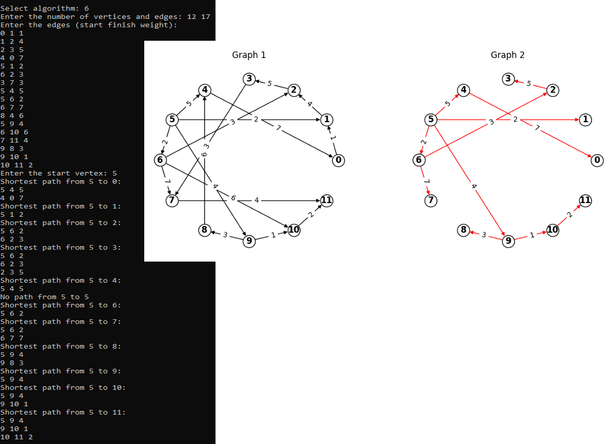

# Graph-Theory-Algorithms

## Description
The goal of this program is to implement, analyze, and visualize a comprehensive suite of fundamental graph theory algorithms. The project utilizes a powerful hybrid architecture: a high-performance C++ backend handles the intense mathematical computations and graph traversals, while a Python script seamlessly reads the output to generate side-by-side visual representations of the data. This tool allows users to interactively build complex networks and immediately see the computed shortest paths, minimum spanning trees, or maximum network flows.

### Algorithm Architecture & Features
The project translates abstract discrete mathematics into 9 distinct, highly optimized algorithms:
* **Graph Traversal:** Breadth-First Search (BFS) and Depth-First Search (DFS) for exploring network topology.
* **Minimum Spanning Trees (MST):** Kruskal's and Prim's algorithms to find the most cost-effective way to connect all nodes in a weighted graph.
* **Shortest Path Finding:** Dijkstra's algorithm (for non-negative weights), Bellman-Ford (handling negative weights), and Floyd-Warshall (for all-pairs shortest paths).
* **Maximum Flow Networks:** Ford-Fulkerson and Edmonds-Karp algorithms to calculate the maximum possible flow in a directed capacity network.

### Technologies Used
* **C++** — core computational engine for executing memory-efficient and fast graph algorithms (`<queue>`, `<vector>`, `<fstream>`).
* **Python** — visualization and data presentation handler.
* **NetworkX & Matplotlib** — applied in Python to render complex node-edge structures, automatically highlighting algorithmic results (e.g., coloring the shortest path red).

### Results
The program successfully compiles and evaluates all 9 graph algorithms. It operates via an interactive CLI where users input nodes, edges, and weights. The C++ engine computes the requested algorithm and exports the results into structured text files (`graph1.txt` and `graph2.txt`). The Python script then interprets these files to render a mathematically accurate side-by-side comparison of the original graph and the optimized subgraph.

### Visualization
The application generates high-quality 2D plots comparing the initial graph topology with the algorithmic output.

<p align="center">
  <b>Graph Algorithmic Output & Visualization</b><br><br>
  <br><br>
  <sub>Original network topology (left) vs Optimized subgraph/path (right)</sub>
</p>

## Quick Start Guide

### 1. Download the Files
Save the C++ source file `Graph-Theory-Algorithms.cpp` and the Python visualization script `graph_visualization.py` to your local machine.

### 2. Install Python Dependencies
The visualization relies on specific Python libraries. Ensure you have Python 3.8+ installed, then open your terminal or command prompt and execute:
```bash
pip install networkx matplotlib numpy
```
